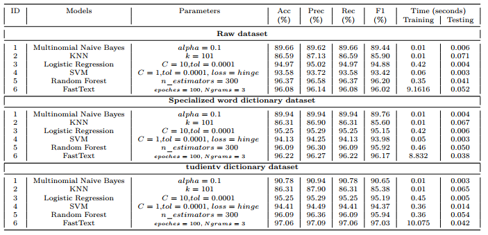
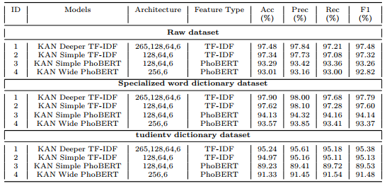

# NEDA-KAN: Enhancing Academic Regulation Classification with NED-Augmented Kolmogorov–Arnold Networks

This repository contains the implementation for the paper:

**"NEDA-KAN: Enhancing Academic Regulation Classification with NED-Augmented Kolmogorov–Arnold Networks"**  
 _CICT, Can Tho University, Viet Nam_

## Abstract

Academic regulation documents are notoriously difficult to classify due to ambiguous, context-dependent phrasing and domain-specific vocabulary. This project integrates **Named Entity Disambiguation (NED)** into the preprocessing pipeline to enhance semantic clarity before classification. We use **Kolmogorov–Arnold Networks (KANs)** and compare their performance with classical machine learning models and FastText.

## Evaluation

### Results of Classification using different dictionaries



### Results of KAN models using different dictionaries



## Installation

```bash
pip install -r requirements.txt
```
